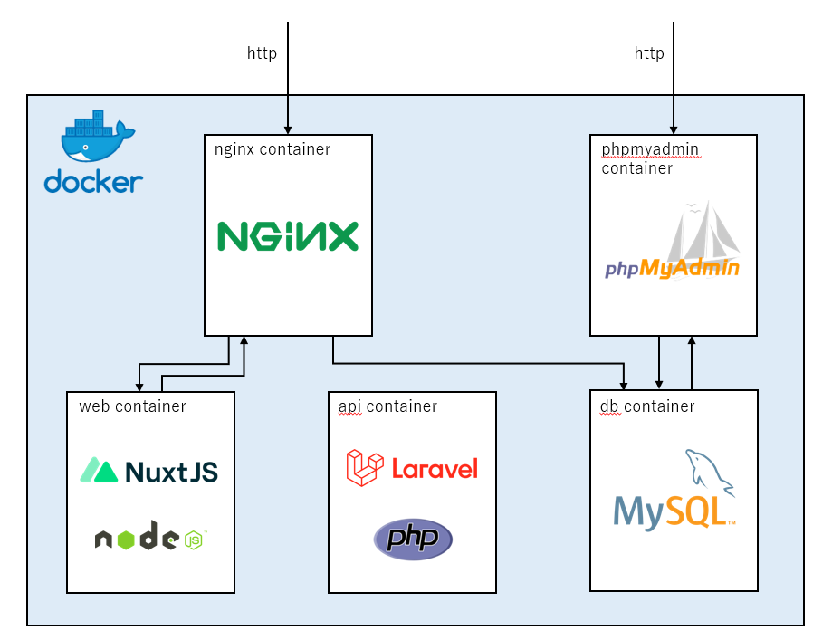

# Nuxt.js and Laravel application

### This is a template for a web application with nuxt and Laravel running on docker.

# Version

- Vue.js : 2.6.14
- Nuxt.js : 2.15.8
- PHP : 8.1.6
- Laravel : 9.11.0
- MySQL : 8.0

# Containers

- web
- api
- nginx
- mysql
- phpMyAdmin

### overview



# 1. Create dotenv

Create a dotenv in the root directory based on the example. If you have no particular preference, you can use the example as is.

Also create the Laravel dotenv (laravel-app/.env) in the same way.

# 2. Launch containers

```
docker-compose up --build -d
```

# 3. Install package

```
docker-compose exec web yarn install
docker-compose exec api composer install
```

# 4. Migrate Database

```
docker-compose exec api php artisan migrate:refresh --seed
```

# 5. Start Nuxt.js in development mode

```
docker-compose exec web yarn dev
```

You can access it at the following URL

http://localhost

# 6. Start Nuxt.js in production mode

```
docker-compose exec web yarn build
docker-compose exec web yarn start
```

You can access it at the following URL

http://localhost

# VSCode extensions that should be installed

- Prettier
- ESLint
- Code Spell Checker
- DotENV
- Vetur
- vuetyfy-vscode
- PHP Debug
- PHP DocBlocker
- PHP import checker
- PHP Intelephense
- PHPUnit
- Laravel Goto Controller
- Laravel Goto View
